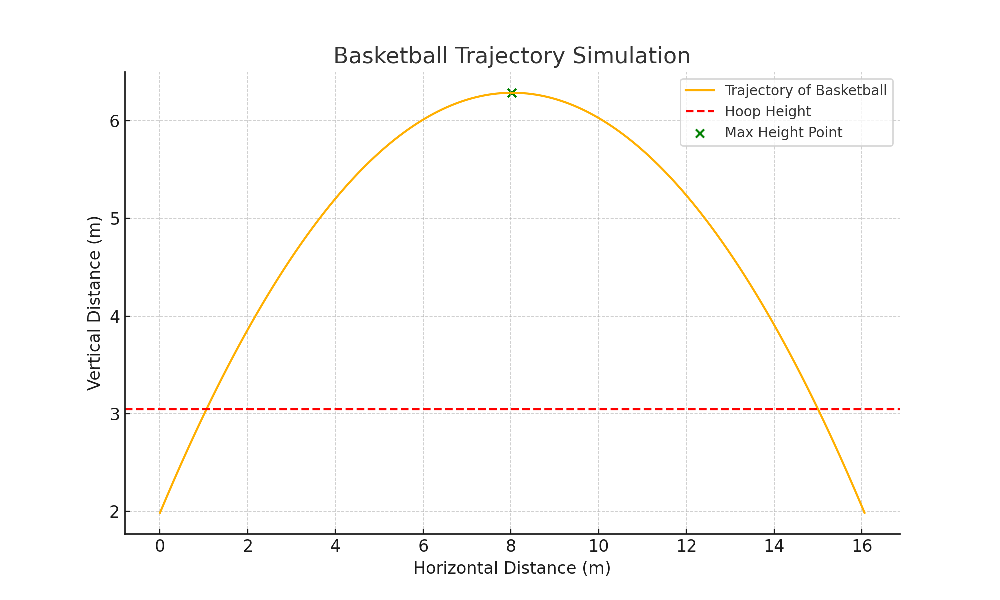

# Basketball Trajectory Simulator in MATLAB

This project is a MATLAB-based physics simulator designed to compute the optimal angle for scoring a basketball. It takes user input for the horizontal distance between the player and the hoop and calculates key parameters of the basketball's trajectory, such as the angle of throw, the maximum height reached by the basketball, and the ground position beneath the point of maximum height. Additionally, the program generates a graphical representation of the basketball's trajectory.

---

## Features
- **Input**: Horizontal distance between the player and the hoop.
- **Output**:
  - Optimal angle (in degrees) required to score.
  - Maximum height reached by the basketball.
  - Ground position corresponding to the basketball's maximum height.
  - Time of flight of the basketball.
- **Graphical Visualization**: A plot showing the basketball's trajectory with key points such as the maximum height and hoop height.

---

## Mathematical Explanation
The project uses equations of projectile motion to calculate the trajectory:
1. **Equation for vertical position**:
   \[
   y(t) = h_{\text{player}} + v_0 \cdot \sin(\theta) \cdot t - \frac{1}{2} g \cdot t^2
   \]
   - \( y(t) \): Vertical height at time \( t \).
   - \( h_{\text{player}} \): Player's height.
   - \( v_0 \): Initial velocity of the basketball.
   - \( \theta \): Launch angle.
   - \( g \): Acceleration due to gravity.

2. **Equation for horizontal position**:
   \[
   x(t) = v_0 \cdot \cos(\theta) \cdot t
   \]
   - \( x(t) \): Horizontal distance at time \( t \).

3. **Optimal Angle Calculation**:
   Using numerical optimization, the program evaluates a range of angles (\( \theta \)) and selects the one that minimizes the required initial velocity \( v_0 \), ensuring the basketball reaches the hoop.

4. **Time of Flight**:
   \[
   t_{\text{flight}} = \frac{2 \cdot v_0 \cdot \sin(\theta)}{g}
   \]

---

## Code Explanation
1. **Constants**:  
   - `g`: Gravitational acceleration (9.81 m/s²).  
   - `h_player`: Player's height (1.986 m).  
   - `h_hoop`: Hoop height (3.048 m).

2. **User Input**:  
   The program prompts the user to input the horizontal distance between the player and the hoop.

3. **Optimization**:  
   The program iteratively tests angles between 30° and 60°, calculating the required initial velocity \( v_0 \) for each angle and selects the angle with the minimum \( v_0 \).

4. **Trajectory Calculation**:  
   Once the optimal angle is determined, the trajectory of the basketball is calculated and visualized.

5. **Visualization**:  
   The basketball's trajectory is plotted, including markers for the hoop height and the maximum height of the ball.

---

## Usage Instructions
1. Clone the repository and open the MATLAB file `Physics.m`.
2. Run the script in MATLAB.
3. Enter the horizontal distance between the player and the hoop when prompted.
4. The program will display the calculated angle, maximum height, ground position, and a graphical visualization of the trajectory.

---

## Example Output
Here is a sample output for an input distance of **15 meters**:

**Graphical Output**:  

- **Optimal Angle**: ~42.3°  
- **Maximum Height**: ~2.9 m  
- **Ground Position for Max Height**: ~7.5 m  

---

## Applications
- Sports analytics to improve player training and performance.
- Educational demonstrations of projectile motion concepts.
- Real-world applications for analyzing basketball trajectories in coaching and gameplay.

---

Feel free to fork and enhance this project or use it as a learning resource for physics simulations in MATLAB!
